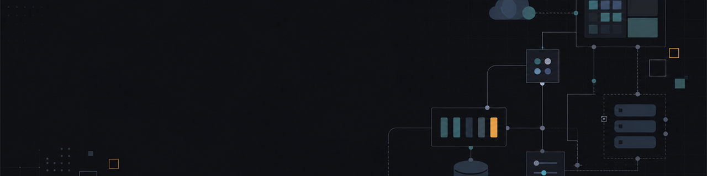

  

<h1 align="center">Lasha Giorgobiani</h1>

  <strong>Full Stack Software Engineer</strong> 
  Tbilisi, Georgia

  I build production web platforms across product interfaces, APIs, data, queues, real time systems, and deployment.

  <a href="https://github.com/Giorgobiani2002?tab=repositories">Projects</a>
  &nbsp;·&nbsp;
  <a href="https://github.com/Meama-DEV">MEAMA Development</a>

## Engineering focus

| Area | Tools and practices |
| --- | --- |
| Product engineering | TypeScript, React, Next.js, accessible responsive interfaces |
| Backend systems | Node.js, NestJS, REST APIs, WebSockets, background jobs |
| Data and infrastructure | PostgreSQL, MongoDB, Redis, Docker, Railway, Vercel |
| Quality | Type safety, validation, unit tests, integration tests, production health checks |

## Selected work

| Project | What it demonstrates | Core stack |
| --- | --- | --- |
| [Pulse AI Sports Intelligence](https://github.com/Giorgobiani2002/AI-SPORT-intelligence) | Production oriented monorepo with bilingual product UI, API, workers, real time match rooms, deterministic scoring, and structured AI analysis | Next.js, NestJS, MongoDB, Redis, BullMQ, Socket.IO |
| [MEAMA Vacancy Platform](https://github.com/Meama-DEV/meama-vacansy) | Recruitment workflow with applicant intake, admin operations, asset upload and download, CSV export, and Railway deployment | Next.js, React, TypeScript, PostgreSQL, Vitest |
| [Next.js Authentication Foundation](https://github.com/Giorgobiani2002/reauthnext) | Authentication and account flows backed by typed forms, schema validation, serverless Postgres, and transactional email | Next.js, NextAuth, Drizzle, Neon, Zod |
| [Luma Backend](https://github.com/Giorgobiani2002/luma-back) | Modular backend service with database persistence, object storage, presigned file access, email, and admin tooling | NestJS, MongoDB, AWS S3, Jest |

## Current direction

I am focused on reliable product systems where frontend experience and backend correctness are designed together. My current work includes real time collaboration, queue driven workloads, secure file handling, and AI features with explicit validation and fallbacks.

  Open to software engineering opportunities and product collaboration.

