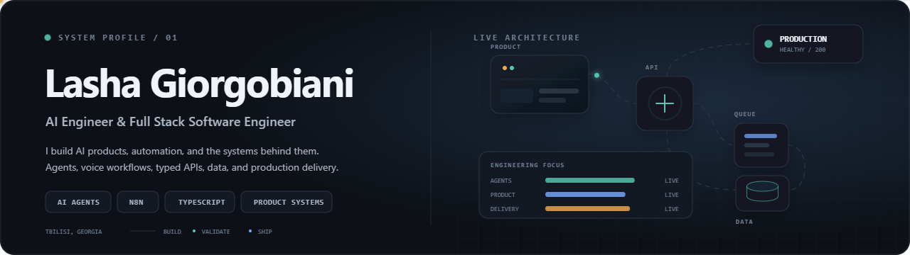
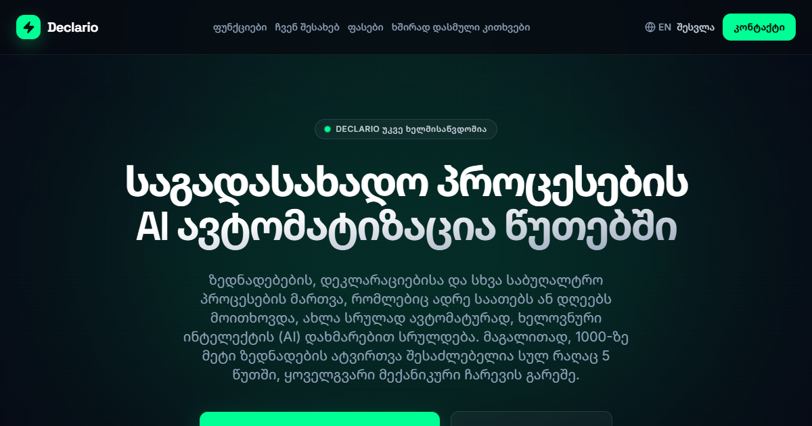
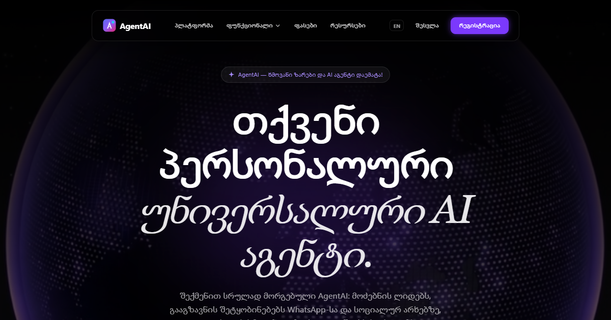
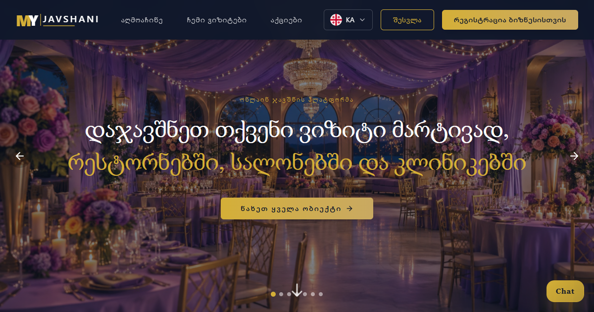

  <picture>
    <source srcset="./assets/system-pulse.svg" type="image/svg+xml" />
    
  </picture>

  I build AI products, intelligent automation, and complete production systems from interface to infrastructure.

  <a href="https://declario.ge">declario.ge</a>
  &nbsp;&middot;&nbsp;
  <a href="https://agentai.ge">agentai.ge</a>
  &nbsp;&middot;&nbsp;
  <a href="https://myjavshani.ge">myjavshani.ge</a>
  &nbsp;&middot;&nbsp;
  Tbilisi, Georgia

## Products

### [declario.ge](https://declario.ge)

AI accounting automation for RS.ge workflows, declarations, waybills, and live operational control.

### [agentai.ge](https://agentai.ge)

A configurable AI workforce for lead discovery, voice calls, social messaging, pipeline automation, and routine operations.

### [myjavshani.ge](https://myjavshani.ge)

An online booking platform that connects customers with restaurants, salons, clinics, and service businesses.

## AI and automation

  
  
  
  
  
  

## Engineering stack

  

  

  AI agents &nbsp;&middot;&nbsp; RAG &nbsp;&middot;&nbsp; voice automation &nbsp;&middot;&nbsp; REST APIs &nbsp;&middot;&nbsp; WebSockets &nbsp;&middot;&nbsp; background jobs &nbsp;&middot;&nbsp; live systems &nbsp;&middot;&nbsp; CI/CD

## GitHub activity

  

  Streaks represent consecutive days with GitHub contributions, including commits, pull requests, and issues.

